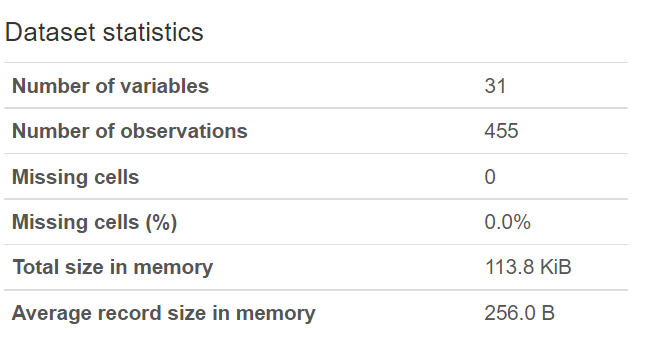

Sanyukta Adap

HI 2454 Data Science in Health Informatics

Date: 04/25/2023

**[Analytical and Machine Learning Approaches to Classify Breast
Cancer]{.underline}**

**Introduction:**

The likelihood of survival is extremely high when cancer is detected and
treated in the earlier stages. It is well known that benign breast
tumors put women at a higher risk of developing breast cancer. Over 1
million women in the USA are diagnosed with benign breast cancer each
year, which is 4 times more prevalent than malignant breast cancer
(Figueroa, 2021). BC cells become more invasive as they become more
flexible. The extent of flexibility is reflected via deformations on the
cells and their nuclei. These deformations change the morphology of the
cell which thus can be used to determine the degree of malignancy of BC
cells. (Antmen, 2019).

Thus, in this study, we aim to classify breast mass as Benign or
Malignant on the basis of the morphology of the cell nuclei.

**Problem and Data:**

In this study, we used the [Breast Cancer
Wisconsin](https://www.kaggle.com/datasets/uciml/breast-cancer-wisconsin-data)
dataset retrieved from the Kaggle repository. We tried to use
characteristics of the breast cell nucleus such as radius, perimeter,
area, texture, etc, based on digitized images of breast mass fluid
samples obtained after a fine needle aspiration (FNA) from subjects with
dense breast masses. An FNA is a procedure in which a doctor draws a
small sample of breast fluid or breast tissue from a suspicious location
using a thin, hollow needle affixed to a syringe. If a breast area is
suspected after an FNA, the sample is examined to look for cancer cells.

This dataset uses the morphological features of the nuclei of these
cells as attributes to predict the presence of malignant or
benign breast cancer. It had 33 columns that comprised the ID,
Diagnosis (M = malignant, B = benign) and Nuclear features. The Mean,
standard error (se), and worst (mean of the three largest values) of
each feature were calculated for every image, resulting in 30 features.
The 33rd column is an Unnamed column. (Fig. 1)

{width="6.268055555555556in"
height="1.81875in"}

**Fig. 1. List of all columns**

**Methodology:**

1.  Data Analysis: The data was first split into train and test sets,
    and all analytics was performed on only the training set, leaving
    the test set untouched. The 'id' and 'Unnamed: 32' columns were
    non-value adding so we eliminated them from the dataset. Then, we
    used pandas profiling to perform some basic descriptive and quantile
    statistics on all the features. The Pandas Profile report indicated
    that there were no null/missing values in the data. So, the only
    step for cleaning was to convert categorical values present in the
    diagnosis into numeric values. We converted benign to 0 and
    malignant to 1.

Then the whole dataset was then normalized using the MinMaxNormalization
function. Once this was done, we performed a set of exploratory data
analyses to view various relationships between features of the dataset.
Lastly, we performed Principle Component Analysis (PCA) on all the
features to obtain new features.

2.  Machine Learning: We trained ML models with both, the original
    features, and the new features obtained from PCA. We used ML
    classifier models such as Logistic Regression (LR), Decision Tree
    (DT), Random Forest (RF), Support Vector Machine (SVM), and
    K-nearest Neighbors (KNN) and compared their performances. The
    individual model performances were then evaluated by calculating the
    accuracy, precision, and recall scores.

For sensitive classifications, such as B and M in this case, we cannot
afford to classify Malignant as Benign, or basically a false negative.
Thus, in such a situation, the recall score is the most important as it
takes into consideration the false negatives.

**Results and Conclusions:**

1.  Statistics: With pandas profiling, we could determine the number of
    variables, no. of observations, missing values, etc., about the
    dataset as a whole (Fig.2). Additionally, it also shows descriptive
    and quantile statistics of each attribute in the dataset. This
    consists of missing values, range, minimum, mean, maximum, standard
    deviation, interquartile range, etc for each attribute.

{width="3.7645833333333334in"
height="2.11875in"}One example of the output in the report is shown in
Fig. 3 and Fig. 4. The report for area_mean indicates that the values
range from approx. 143 to 2501 with a mean of 663 (Fig. 3). The graph
shown in Fig. 4 is a histogram of the values in the area_mean attribute.
Looking at the image, we can say that the graph is skewed to the left,
but the profile report gives the exact value of skewness.

**Fig. 3. Pandas Profile Report consisting of Quantile and Descriptive
Statistics for area_mean**

**Fig. 4. Pandas Profile Report consisting of Histogram for area_mean**

2.  Exploratory Data Analysis: We plotted a heat map (Fig. 5) with
    normalized values of training data to determine the direct
    correlation between the variables. If we look closely at the darker
    shades of blue in the heatmap, we can observe that features related
    to radius, perimeter, and area are highly correlated with each
    other. Seems like a logical conclusion to draw since the larger the
    radius, the larger the perimeter, and the larger the area!

The scatter plots shown in Fig. 6 are plotted based on the top 3
prevalent features that had the strongest correlations with the label,
i.e., the diagnosis (shown with red boxes). Though the plots seem to be
able to distinguish between the two labels, there isn\'t a clear line of
distinction between them. There still exists a significant overlap
between the green and red
{width="5.0472222222222225in"
height="4.80625in"}dots, thus they alone won\'t be able to give good
accuracy.

**Fig. 5. Heatmap showing correlation coefficients between all
attributes in the dataset. The red markers indicate the top 3 prevalent
features that show a strong correlation with the label (diagnosis)**

3.  Dimensionality Reduction with PCA: We performed PCA on all 30
    features to obtain 30 new features with the variance of the
    distribution of data in the decreasing order shown in Fig. 7. The
    the first point in the output shows the new features in decreasing order
    of variance, that is, how well they distribute and spread the data.
    The 2^nd^, 3rd, and the points further down show the combined
    variance value of the first 2, first 5, ... up to the first 20
    features. For example, with just the first 10 features obtained by
    PCA, we can distinguish approx. 96% of the data! The reason why
    these new features are better is that the more the data is spread,
    the easier it is to categorize them into B and M.

{width="4.372549212598425in"
height="4.275804899387577in"}

{width="5.322916666666667in"
height="2.7930555555555556in"}**Fig. 6. Scatter plot for top 3 prevalent
features obtained from The Heatmap in Fig. 5.**

***Fig. 7. Variance of new features obtained by performing PCA.***

**1. Variance values for the new 30 features in decreasing order**

**2. The first feature itself has a variance value of approx. 53%**

**3. The first 2 features combined have a variance value of approx.
71%**

**4. The first 5 features combined have a variance value of approx.
88%**

**5. The first 10 features combined have a variance value of approx.
96%**

**6. The first 15 features combined have a variance value of approx.
99%**

***7. The first 20 features combined have a variance value of approx.
99.6%***

4.  Evaluating Performances of the ML Models for Original 30 Features:
    We ran ML classifier models with the original features and Fig. 8 is
    a joint bar graph of the performance evaluations of each model.
    According to the graph, the accuracy of the DT and RF models of the
    training set is 1, but the corresponding test set has a
    significantly lower accuracy. This means that the model is
    overfitting on the training set and not learning general patterns.

The other models show an expected pattern where they have a test
accuracy slightly lower than the training accuracy. This shows that they
are not overfitting. Of all the models, SVM has the highest test
accuracy.

{width="7.130129046369204in"
height="2.8491305774278217in"}

**Fig. 8. Evaluating Performances of the ML Models for Original 30
Features**

The precision of DT and RF models of the training set is 1, but the
corresponding test set has a significantly lower precision. This means
that these test set models have a higher number of false positives. The
other models, in contrast, have a slightly lower precision score for the
training set. This shows that they have a few false positives.

For the test set, LR, SVM, and KNN have a precision of 1. This means
that there are no false positives. The model that has the best
combination of precision scores is SVM. The recall score of SVM for the
testing set is the highest among other models. This means that the model
has fewer false negatives. On the other hand, the recall score for all
other test set models is low, which means that there are quite a few
false negatives. Overall, DT and RF had the lowest performance, and SVM
had the best overall model performance.

5.  Evaluating ML Models with Test Set Recall Scores for Features
    Obtained after PCA: We used the same ML models again with the new
    features that were obtained after PCA. We ran all the models for the
    first 5, 10, 15, 20, and all 30 features. We then plotted a line
    graph that shows the test set model performances based on the Recall
    score (Fig. 9). The X axis on the plot shows the number of new
    features used to train and test the model, and the Y axis consists
    of the recall scores.

> {width="3.8131944444444446in"
> height="2.675in"}According to the plot, the models\' performances do
> not improve as we increase the number of features from 5 to 30.
> (Except KNN which stops increasing after 15). This means that just the
> Top 5 (15 for KNN) PCA features are needed to achieve the best
> possible performance.
>
> However, the best model under PCA still doesn\'t perform as well as
> the best model with the 30 original features, that is, the test set
> SVM model with a recall score of 92.3%). Except for logistic
> regression, all have the same recall score. This shows that the PCA
> features themselves are not that great compared to the original
> features. In this case, again, DT and RF performed poorly as shown in
> the figure. This means that both models are overfitting on the train
> data instead of following a general pattern.
>
> **Discussion**:
>
> For sensitive classifications, such as B and M in this case, we cannot
> afford to classify Malignant as Benign. Thus, in such a situation, the
> recall score is the most important. DT and RF models were highly
> overfitting on the training data. This is why they had poor model
> performance. The best model under PCA still doesn\'t perform as well
> as the best model with the 30 original features. This shows that PCA
> features themselves are not that great. Of all the models SVM had the
> best model performance with high test set accuracy, precision, and
> recall scores. This means that SVM is the best model for the
> classification of BC, however, its recall score was just 92.3%. This
> score can be increased by possibly increasing the amount of training
> data, or by implementing more complex models such as Artificial Neural
> Networks.

**References**:

Figueroa, J. D., Gierach, G. L., Duggan, M. A., Fan, S., Pfeiffer, R.
M., Wang, Y., ... Rohan, T. E. (2021). *Risk factors for breast cancer
development by tumor characteristics among women with benign breast
disease*. Breast Cancer Research, 23(1). doi:10.1186/s13058-021-01410-1

Antmen, E., Demirci, U., & Hasirci, V. (2019). *Amplification of Nuclear
Deformation of Breast Cancer Cells by Seeding on Micropatterned Surfaces
to Better Distinguish Their Malignancies.* Colloids and Surfaces B:
Biointerfaces, 110402.
doi:10.1016/j.colsurfb.2019.11040210.1016/j.colsurfb.2019.110402
